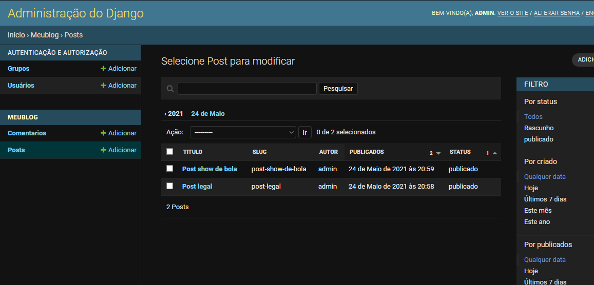

# meu-blog

------

**Alunos:** Guilherme, Daniel, Harlesson

**Professor:** Marcos Faino

**Curso Superior Tecnólogo em Análise e Desenvovimento de Sistemas**

**IFRO - Campus Ariquemes**

----

Atividade de **Programação Web III** - Desenvolvendo um blog com Django 

Continue a criação do blog, dessa vez adicionando um sistema de adição de comentários aos posts

- [x] Criar um modelo para salvar os comentários. 
  
  

- [x] Criar um formulário para submeter comentários e validar os dados de entrada. 

  
  

- [x] Adicionar uma view que processe o formulário e salve um novo comentário no banco de dados.
  
- [x] Modificar o template de detalhes do post para exibir a lista de comentários e o formulário para adicionar um novo comentário.

------

